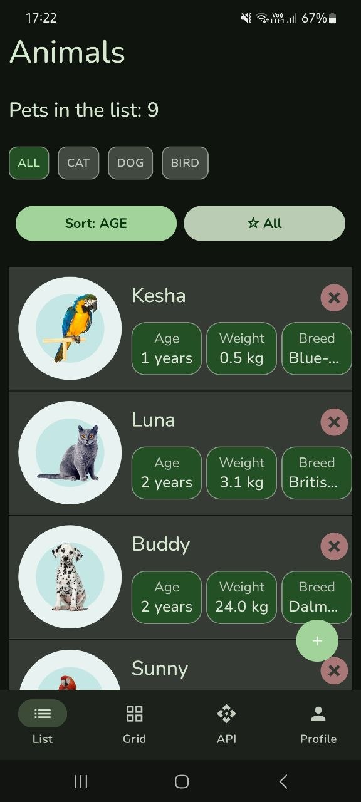
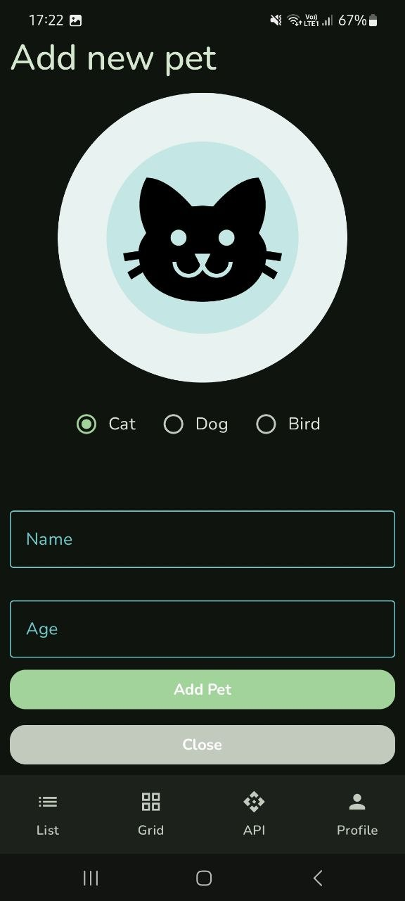
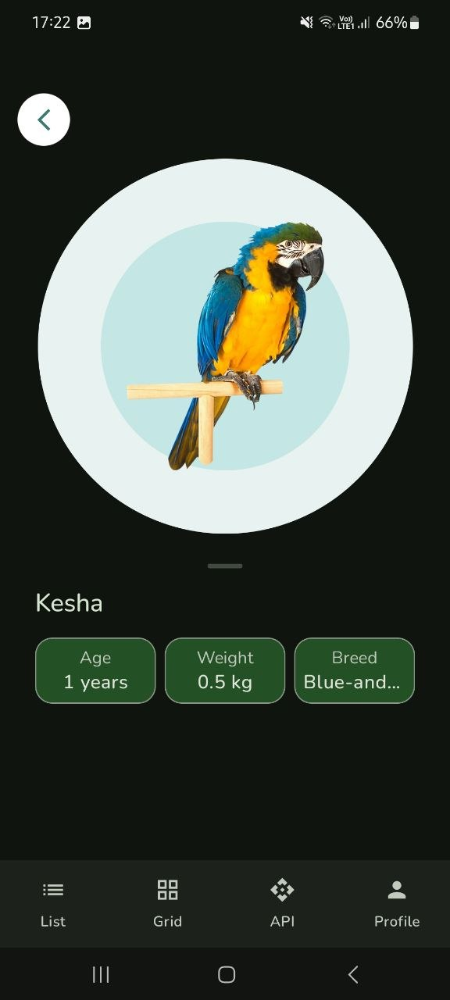

# Документ для публікації застосунку PetCare

## 1. Інформація про застосунок

- **Повна назва:** PetCare - Ваш помічник у догляді за улюбленцями
- **Короткий опис (Google Play):** Керуйте списком своїх улюбленців, їхніми профілями та планами догляду. *(72 символи)*
- **Підзаголовок (App Store):** Ваш цифровий щоденник улюбленця *(29 символів)*
- **Повний опис:**

PetCare — це універсальний додаток, створений спеціально для відповідальних власників домашніх тварин. Завдяки зручному інтерфейсу ви можете легко вести облік своїх котів, собак, птахів та інших улюбленців. Додаток дозволяє створювати детальні профілі з іменами, віком та породами, а також переглядати інформацію у зручному форматі списку або сітки. Завдяки інтеграції з камерою ви можете додавати фотографії прямо в додаток, а сервіси локації допоможуть знайти корисні місця поруч. PetCare розроблений з урахуванням сучасних стандартів доступності та адаптивного дизайну, що забезпечує комфортну роботу на будь-яких пристроях.

- **Категорія:** Lifestyle / Pets (Спосіб життя / Тварини)
- **Вікова класифікація:** 3+ (для будь-якого віку)

---

## 2. Скріншоти

### Головний екран (Список улюбленців)


### Форма додавання улюбленця


### Профіль улюбленця


---

## 3. Технічна інформація

- **Мінімальна версія ОС:** Android 7.0 (API 24)
- **Цільова версія ОС:** Android 15 (API 35)

### Дозволи та обґрунтування

| Дозвіл | Обґрунтування для користувача |
|:---|:---|
| `CAMERA` | Дозвольте доступ до камери, щоб ви могли зробити фото свого улюбленця для його профілю. |
| `ACCESS_FINE_LOCATION` | Додаток використовує точні дані про місцезнаходження для визначення відстані до найближчих ветеринарних клінік. |
| `ACCESS_COARSE_LOCATION` | Використовується як запасний варіант для визначення приблизного місцезнаходження коли точна геолокація недоступна. |

---

## 4. Опис процесу підпису та збірки

### Android (Google Play)

1. **Створення Release Keystore**
    - В Android Studio перейти у `Build → Generate Signed Bundle / APK`
    - Обрати `Android App Bundle`
    - Натиснути `Create new` під Key store path
    - Створити файл `.jks`, задати паролі для сховища та ключа

2. **Налаштування `build.gradle.kts`**
```kotlin
android {
    signingConfigs {
        create("release") {
            storeFile = file("keystore.jks")
            storePassword = "your_store_password"
            keyAlias = "your_key_alias"
            keyPassword = "your_key_password"
        }
    }
    buildTypes {
        release {
            isMinifyEnabled = true
            isShrinkResources = true
            signingConfig = signingConfigs.getByName("release")
            proguardFiles(
                getDefaultProguardFile("proguard-android-optimize.txt"),
                "proguard-rules.pro"
            )
        }
    }
}
```

3. **Генерація AAB**
    - Виконати `./gradlew bundleRelease`
    - Або через меню `Build → Build Bundle(s) / APK(s) → Build Bundle(s)`
    - Отриманий `.aab` файл завантажується в Google Play Console

### iOS (App Store)

1. **Certificate & Profile** — створити `Distribution Certificate` в Apple Developer Portal та налаштувати `Provisioning Profile` для App Store
2. **Xcode Setup** — вибрати `Generic iOS Device`, налаштувати `Signing & Capabilities`
3. **Archive** — `Product → Archive`, Xcode збілдить проект та відкриє Organizer
4. **Upload** — в Organizer натиснути `Distribute App → App Store Connect`